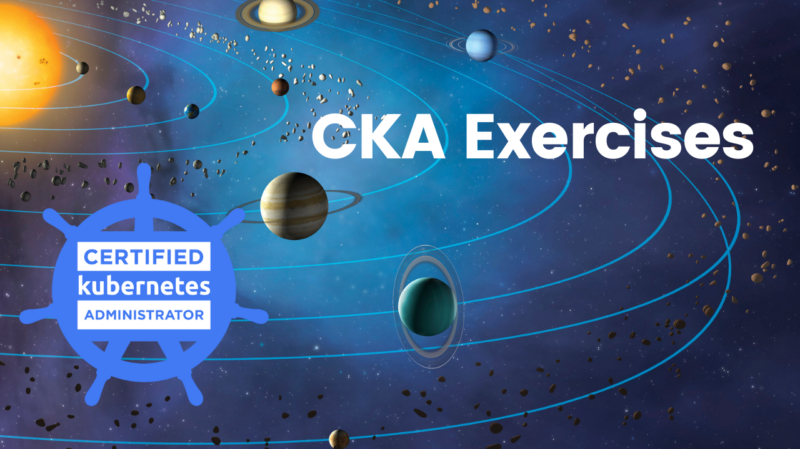

# CKA Certified Kubernetes Administrators

I started preparation for the CKA Kubernetes exam. In this series, I will share some exercises I find useful during my preparation in order to help you better prepare for the CKA exam. I will gather all exercises in this GitHub account, clone this repo to get all exercises at once.

### CKA series published posts:

* [Section 1: Introduction](introduction.md)
* [Section 2: Core Concepts](core-concepts.md)
* [Section 3: Scheduling](scheduling.md)
* [Section 4: Logging & Monitoring](logging-monitoring.md)
* [Section 5: Application Lifecycle Management](application-lifecycle-management.md)
* [Section 6: Cluster Maintenance](cluster-maintenance.md)
* [Section 7: Security](security.md)
* [Section 8: Storage](storage.md)
* [Section 9: Networking](networking.md)
* [Section 10: Design and install a Kubernetes Cluster](design-install-kubernetes-cluster.md)
* [Section 11: Install "Kubernetes the Kudeadm way"](install-kubernetes-the-kubeadm.md)
* [Section 12: End to End Tests on a Kubernetes Cluster](end-end-tests-kubernetes-cluster.md)
* [Section 13: Troubleshooting](troubleshooting.md)
* [Section 14: Other topics](other-topics.md)